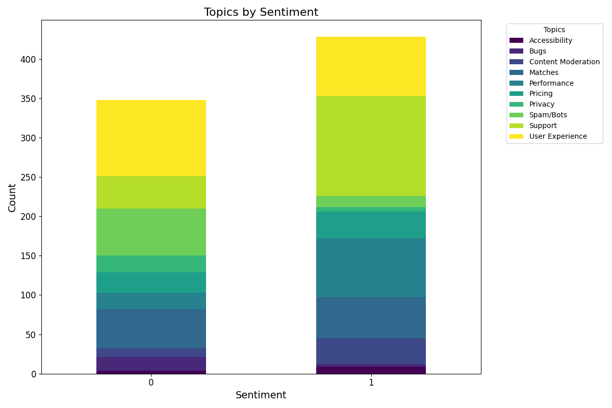

# **Sentiment Analysis and Topic Classification of Dating App Reviews**

## **Overview**
This project involves sentiment analysis and topic classification of user reviews for a popular dating app. The goal is to understand user feedback, classify sentiments into positive and negative, and identify common topics of discussion. The project leverages machine learning techniques, including **TF-IDF vectorization**, **LinearSVC**, and **Zero-Shot Classification** with the **Facebook BART-MNLI** model.

---

## **Project Features**
- **Sentiment Analysis**:
  - Classifies reviews as **Positive** or **Negative** based on user feedback.
  - Excludes neutral sentiments to focus on actionable insights.

- **Topic Classification**:
  - Identifies key discussion topics in user reviews.
  - Uses **Zero-Shot Classification** for topic labeling.

- **Visualization**:
  - Bar plots to show the distribution of sentiments.
  - Topic breakdown for each sentiment class.
  - Confusion matrices for model evaluation and feature importance plots.

- **Preprocessing**:
  - Cleaning user reviews by removing stopwords, punctuation, and special characters.
  - Tokenization, stemming, and lemmatization for effective feature extraction.

- **Model Persistence**:
  - Trained models and vectorizers are saved and retrieved using **Hopsworks** feature store.

---

## **Technologies Used**
- **Python**:
  - Libraries: `scikit-learn`, `nltk`, `transformers`, `pandas`, `matplotlib`, `seaborn`
- **Machine Learning**:
  - **TF-IDF** for feature extraction.
  - **LinearSVC** for sentiment classification.
  - **Zero-Shot Classification** using `facebook/bart-large-mnli`.
- **Data Management**:
  - **Hopsworks** for feature store integration and model storage.

---

## **File Structure**
```plaintext
├── .github/workflows/         # GitHub actions and CI/CD workflows
├── docs/
│   └── sentiment/
│       └── assets/img/
│           └── sentiment_topics.png  # Plot of sentiment topics
├── functions/                 # Utility functions and preprocessing scripts
├── notebooks/
│   ├── reviews_backfill.ipynb   # Notebook for backfilling reviews
│   ├── reviews_training.ipynb   # Notebook for training the sentiment model
│   ├── reviews_inference.ipynb  # Notebook for sentiment classification
├── reviews_sentiment_model/
│   └── model.pkl              # Trained LinearSVC sentiment classification model
├── vectorizer/
│   └── vectorizer.pkl         # Trained TF-IDF vectorizer
├── README.md                  # Project documentation
├── requirements.txt           # List of Python dependencies
```
---

## **Setup and Installation** 
### **Step 1: Create Virtual Environment**
In the project folder, create a new conda environment:
```bash
conda create -n myenv python==3.10
```
### **Step 2: Activate Environment**
Activate the newly created environment:
```bash
conda activate myenv
```
### **Step 3: Install Dependencies**
Install the required packages:
```bash
pip install -r requirements.txt
```
### **Step 4: Run Jupyter Notebook**
Start a Jupyter server and run the notebooks:
```bash
jupyter notebook
```
### **Step 5: Deactivate Environment**
To leave the environment:
```bash
conda deactivate
```

## **Results**

### **Sentiment Distribution**
- **Positive Sentiments**: 57%
- **Negative Sentiments**: 43%

### **Model Evaluation**

#### **Training Confusion Matrix**


#### **Testing Confusion Matrix**


### **Feature Importance**
Feature importance as determined during model training:


- **Top Features**:
  - `stupid`
  - `hate`
  - `enjoying`

### **Sentiment Topics**
Breakdown of top topics by sentiment:



- **Positive Topics**:
  - Support
  - User Experience
  - Matches

- **Negative Topics**:
  - User Experience
  - Spam/Bots
  - Matches

## **Setup and Installation** 
### **Step 1: Create Virtual Environment**
In the project folder, create a new conda environment:
```bash
conda create -n myenv python==3.10
```
### **Step 2: Activate Environment**
Activate the newly created environment:
```bash
conda activate myenv
```
### **Step 3: Install Dependencies**
Install the required packages:
```bash
pip install -r requirements.txt
```
### **Step 4: Run Jupyter Notebook**
Start a Jupyter server and run the notebooks:
```bash
jupyter notebook
```
### **Step 5: Deactivate Environment**
To leave the environment:
```bash
conda deactivate
```
## **Future Work**

- **Expand topic classification** with more granular topics.
- **Integrate additional datasets** for better generalization.
- **Explore deep learning models** for sentiment analysis.

