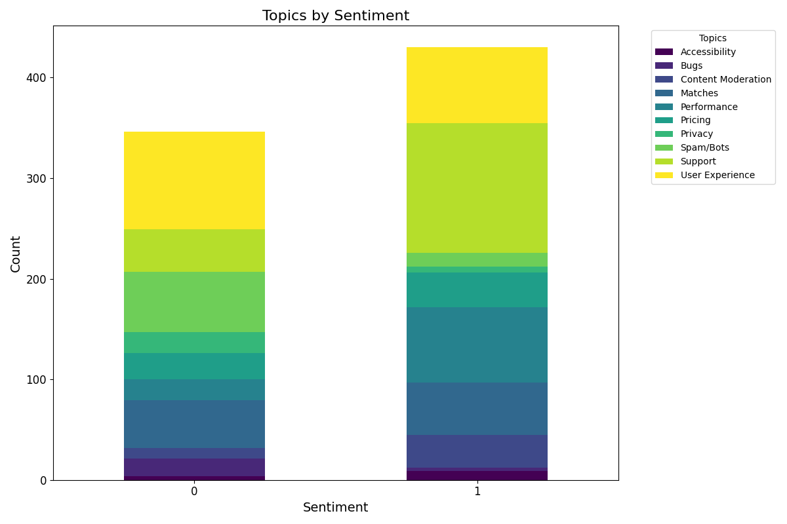

# **Tinder Reviews Sentiment Analysis**

This project analyzes user reviews of the Tinder app to extract sentiments and classify topics. The results help identify key trends and areas of improvement for the app.

---

## **Sentiment Prediction Results**
The output includes sentiment predictions (positive or negative) for user reviews and classified topics such as pricing, user experience, and bugs.



---

## **Application Features**
1. **Sentiment Analysis**:
   - Predicts whether reviews are positive or negative using a trained Linear SVC model.

2. **Topic Classification**:
   - Categorizes reviews into topics such as Pricing, Bugs, and Privacy.

3. **Data Visualization**:
   - Word clouds and bar charts provide insights into user feedback.

---

## **Application Architecture**

  
(*Include your architecture image if available.*)

---

## **How to Run the Application**

### **Prerequisites**
1. Install dependencies:
   ```bash
   pip install hopsworks google-play-scraper nltk transformers
   ```
2. Set up your Hopsworks API key as an environment variable:
   ```bash
   export HOPSWORKS_API_KEY="your_api_key"
   ```

### **Steps**
1. **Collect Reviews**:
   Run the `reviews_backfill.py` script to fetch and preprocess reviews from the Google Play Store.

2. **Train the Model**:
   Use the `reviews_training.py` script to train a Linear SVC model and store it in the Hopsworks Feature Store.

3. **Inference**:
   Execute the `reviews_inference.py` script to predict sentiments for new reviews and classify topics.

4. **Results**:
   - Predictions are saved to the Feature Store for monitoring.
   - CSV file (`classified_reviews.csv`) contains labeled reviews.
   - Visualizations are saved as PNG files.

---

## **Example Outputs**
1. **Word Cloud for Positive Reviews**:
   

2. **Word Cloud for Negative Reviews**:
   

3. **Topic Sentiment Distribution**:
   
